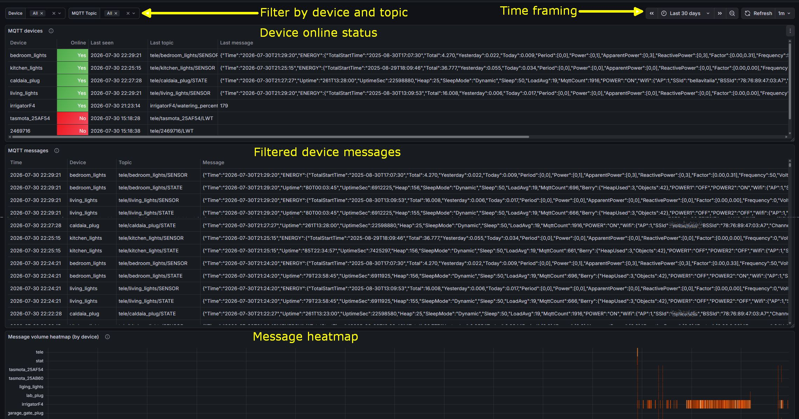

# HA MQTT Logger

A single Home Assistant app that logs every MQTT message seen by your
broker into Loki, then gives you a Grafana dashboard to see which devices
are online and to search the raw message history - filterable by device and
topic. Node-RED, Loki, and Grafana all run inside the app itself; there's
nothing else to install or wire up by hand.



## Architecture

```
MQTT broker (core-mosquitto)
   -> Node-RED  ("MQTT -> Loki Logger" flow: filter, label, forward)
        -> Loki (log storage, in-container)
             -> Grafana ("MQTT Devices" dashboard, reached via the sidebar)
```

The [mqtt_logger/](mqtt_logger/) folder is the app itself - see
[mqtt_logger/DOCS.md](mqtt_logger/DOCS.md) for full configuration,
troubleshooting, and known limitations once it's installed.

## Installing

[](https://my.home-assistant.io/redirect/supervisor_add_addon_repository/?repository_url=https%3A%2F%2Fgithub.com%2Figrowing%2FHA_MQTT_Logger)

1. Click the button above (opens your own Home Assistant instance and
   pre-fills the repository URL), or add it manually: Settings ->
   Add-ons/Apps -> Add-on/App Store -> ⋮ -> Repositories -> paste
   `https://github.com/igrowing/HA_MQTT_Logger`.
2. Find **MQTT Logger** in the store and install it.
3. Before starting it: install the official **Mosquitto broker**
   app/add-on if you don't already have one, and create a dedicated MQTT
   user for this app under Settings -> People -> Users (don't reuse your own
   admin account).
4. Open **MQTT Logger**'s Configuration tab, set `mqtt_username` /
   `mqtt_password` to that user, and adjust `retention_days` /
   `filter_regex` if you want (defaults: 30 days, no extra filtering beyond
   the built-in HA-discovery/system-topic noise filters).
5. Return to **MQTT Logger**'s Info tab and assert:
  - "Show in sidebar" - for ease of access to the app;
  - "Watchdog" - for restert of the app if crashes (not likely but safe!)
  - "Auto update" - optionally.
6. Start the app. **MQTT Logger** appears in the sidebar with the dashboard
   ready - no separate Grafana login, no manual Node-RED flow import, no
   Loki setup.

See [mqtt_logger/DOCS.md](mqtt_logger/DOCS.md) for how to verify it's
working end-to-end and for troubleshooting.

## Architectures

`amd64` and `aarch64` are the supported, CI-tested targets. `armv7`/`armhf`
builds are attempted best-effort only (Home Assistant Supervisor dropped
32-bit support in the 2025.12 release line) - see
[mqtt_logger/DOCS.md](mqtt_logger/DOCS.md#known-limitations).

## License

[MIT](LICENSE)

## How to contribute

* [Open an issue](https://github.com/igrowing/SimplyNet/issues) if you found a bug or want a new feature.

*  <a href="https://www.buymeacoffee.com/igrowing" target="_blank"></a> if you like the app and it makes your life a bit simpler.